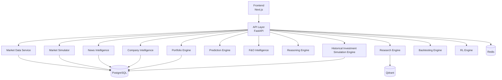
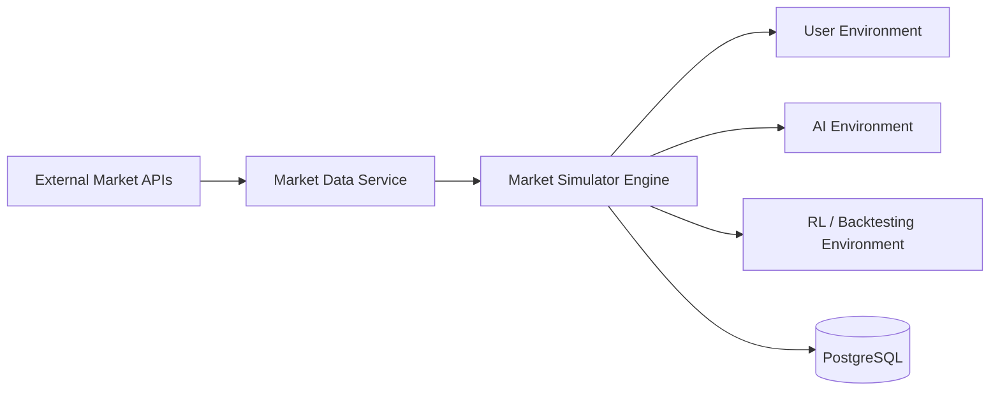
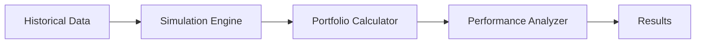
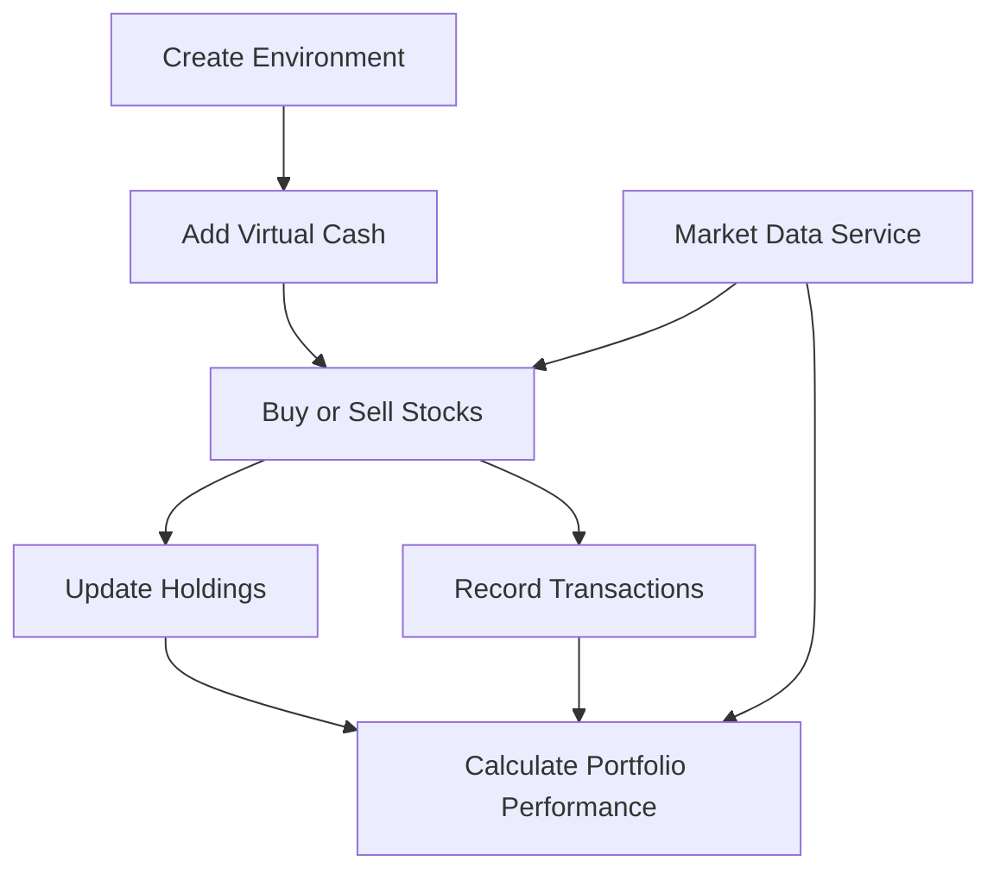
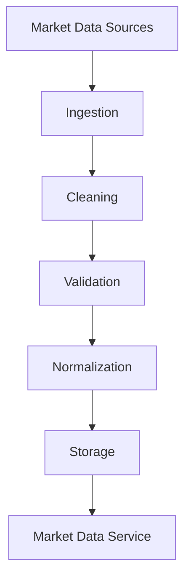
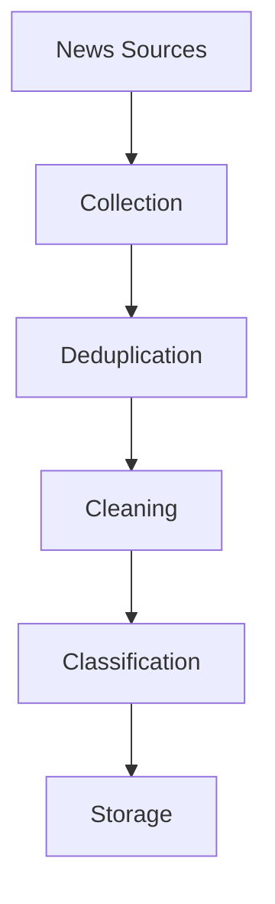
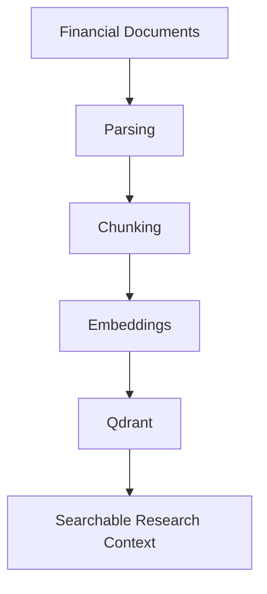
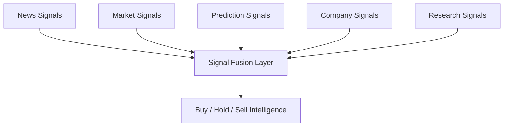
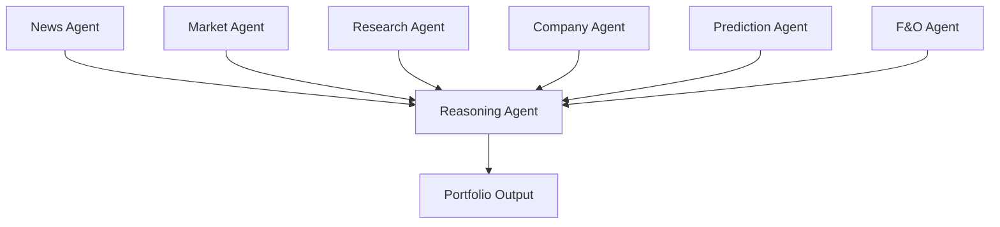
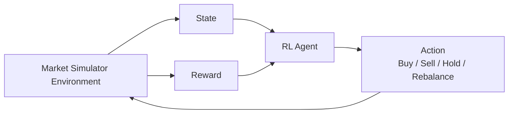

# Prospera - Development Plan

> Transforming information into intelligent decisions that create long-term prosperity.

---

# Project Vision

Prospera is an agentic financial intelligence platform that combines:

* Market simulation
* Portfolio management
* Historical investment simulation
* News intelligence
* Financial research
* Company analysis
* Prediction models
* F&O intelligence
* Multi-agent systems
* Reinforcement learning
* Explainable AI

The goal is not simply to predict stock prices.

The goal is to build a complete intelligence system capable of understanding financial information, generating investment insights, evaluating opportunities, and continuously learning from market outcomes.

This includes the ability to reconstruct historical portfolios, simulate past investment decisions, and evaluate how different allocation strategies would have performed over time.

---

# Current Priority

The immediate priority is the **V1 backend foundation**:

* Market simulator architecture
* Isolated environments
* Centralized market data service
* Backend environment setup
* Clean folder structure
* Future-ready design without premature complexity

---

# Core Technology Stack

## Frontend

* Next.js
* React
* TypeScript
* Tailwind CSS
* Shadcn UI
* Recharts
* TanStack Query

## Backend

* FastAPI
* Python
* Pydantic
* SQLAlchemy

## Database Layer

* PostgreSQL
* Redis

## AI Layer

* LangGraph
* Local LLMs
* Ollama / vLLM
* Sentence Transformers

## Vector Database

* Qdrant

## Machine Learning

* Scikit-Learn
* XGBoost
* LightGBM
* PyTorch
* TensorFlow

## Reinforcement Learning

* Stable Baselines3
* Gymnasium

## Infrastructure

* Docker
* GitHub
* GitHub Actions

---

# System Architecture



## Foundation Flow



## Historical Investment Simulation Flow



The Historical Investment Simulation Engine should be built as a reusable internal service that supports both user-facing analysis and future AI-driven optimization workflows.

This capability will later become a foundational component for:

* Portfolio Intelligence
* Backtesting
* AI Portfolio Management
* Reinforcement Learning
* Strategy Optimization

---

# PHASE 1 - Planning & Architecture

## Objectives

* Define project scope.
* Design complete architecture.
* Create database schema.
* Define API contracts.
* Create folder structure.
* Define agent communication format.
* Define reusable internal service contracts for historical portfolio simulation and performance analysis.

## Deliverables

* System design diagrams.
* ER diagrams.
* API specifications.
* Development roadmap.
* Historical simulation service boundaries for portfolio and backtesting workflows.

---

# PHASE 2 - Project Setup

## Objectives

* Setup repository.
* Setup backend environment.
* Setup dependency management.
* Setup documentation.
* Setup PostgreSQL.
* Setup CI/CD foundation.

## Deliverables

* Running backend environment.
* Stable dependency setup.
* Backend setup documentation.
* Prepared database and infrastructure foundation.

---

# PHASE 3 - Frontend Foundation

## Objectives

Build reusable UI architecture.

### Pages

* Landing Page
* Authentication
* Dashboard Layout

### Components

* Sidebar
* Navbar
* Charts
* Cards
* Tables
* Forms

### Features

* Responsive UI
* Global theme system
* Reusable dashboard layout

## Deliverables

* Professional SaaS UI foundation.

---

# PHASE 4 - Core Database Layer

## Tables

### Users

* Profile
* Preferences

### Wallets

* Virtual Cash

### Transactions

* Buy
* Sell

### Holdings

* Portfolio Assets

### Watchlists

* Saved Assets

### Stocks

* Market Data

### News

* Articles

### Signals

* AI Signals

### Predictions

* Forecast History

## Deliverables

* Stable database architecture.

---

# PHASE 5 - Market Simulator

## Objectives

Create paper trading system.

### Features

* Virtual money
* Buy and sell stocks
* Holdings
* Portfolio tracking
* P&L tracking
* Watchlist
* Future compatibility with reusable historical simulation services

## Flow



## Deliverables

* Functional market simulator.

---

# PHASE 6 - Market Data Pipeline

## Objectives

Collect and maintain:

* Historical stock prices
* Index data
* Mutual fund NAV data
* Company information
* Sector information

## Processing



## Deliverables

* Automated market data warehouse.

---

# PHASE 7 - News Intelligence Pipeline

## Objectives

Collect:

* Global news
* Indian news
* Company news
* Sector news

## Processing



## Deliverables

* News warehouse.

---

# PHASE 8 - Event Extraction Engine

## Objectives

Convert raw news into structured events.

### Extract

* Company
* Sector
* Event Type
* Sentiment
* Importance

Example:

```json
{
  "company": "NVIDIA",
  "event": "earnings_beat",
  "sentiment": "positive"
}
```

## Deliverables

* Structured event database.

---

# PHASE 9 - Financial Research RAG

## Documents

* Annual Reports
* Earnings Calls
* Investor Presentations
* Research Reports

## Pipeline



## Deliverables

* Searchable financial knowledge base.

---

# PHASE 10 - Company Intelligence Engine

## Analyze

* Revenue Growth
* Profit Growth
* Debt
* Cash Flow
* Valuation
* Management Signals

## Outputs

* Company Score
* Growth Score
* Risk Score

## Deliverables

* Company intelligence service.

---

# PHASE 11 - Financial Reasoning Engine

## Inputs

* News Signals
* Company Analysis
* Research Context
* Market Data

## Outputs

* Bullish
* Bearish
* Neutral

with explanations.

## Deliverables

* Explainable reasoning system.

---

# PHASE 12 - Prediction Models

## Baseline Models

* Logistic Regression
* Random Forest
* XGBoost
* LightGBM

## Advanced Models

* LSTM
* GRU
* TFT

## Deliverables

* Prediction API.
* Forecast dashboard.

---

# PHASE 13 - Signal Fusion Layer

## Combine

* News Signals
* Market Signals
* Prediction Signals
* Company Signals
* Research Signals

## Generate

* Buy
* Hold
* Sell

## Flow



## Deliverables

* Unified decision engine.

---

# PHASE 14 - AI Portfolio Manager

## Objectives

Generate AI-managed portfolios.

### Features

* Asset Allocation
* Risk Analysis
* Portfolio Health
* Rebalancing Suggestions
* Historical scenario comparison
* Allocation optimization using simulation feedback

## Historical Investment Simulation Integration

Future AI systems should be able to:

1. Create a portfolio.
2. Run a historical simulation.
3. Observe performance metrics.
4. Modify allocations.
5. Re-run simulations.
6. Compare results.
7. Select better-performing strategies.

The Historical Investment Simulation Engine should support repeated simulation cycles so portfolio agents can iteratively improve allocations and evaluate tradeoffs before recommending strategies.

## Deliverables

* AI portfolio system.

---

# PHASE 15 - Backtesting Engine

## Objectives

Replay historical markets.

### Features

* Historical simulation
* Lump Sum investment simulations
* SIP (Systematic Investment Plan) simulations
* Multi-asset portfolio simulations
* Historical portfolio reconstruction
* Portfolio performance analysis
* Strategy testing
* Benchmark comparison

### Example Use Cases

* If I invested Rs.100,000 in NVIDIA 5 years ago, what would it be worth today?
* If I invested Rs.5,000 monthly into a mutual fund for 10 years, what would the current value be?
* What would happen if I allocated 50% to Nifty, 30% to NVIDIA, and 20% to Apple?

## Internal Service Design

The Historical Investment Simulation Engine should be implemented as a reusable internal service shared across portfolio intelligence, backtesting, and future AI portfolio workflows.

### Core Responsibilities

* Construct portfolios from user-defined or agent-generated allocations
* Replay historical investment decisions across one or more assets
* Support lump sum and SIP cash flow modeling
* Reconstruct historical holdings and portfolio states
* Evaluate rebalancing impact and allocation drift
* Produce reusable performance and risk analytics outputs

### Metrics

#### Return Metrics

* Total Return
* CAGR
* XIRR
* Annualized Return

#### Risk Metrics

* Volatility
* Sharpe Ratio
* Sortino Ratio
* Maximum Drawdown

#### Portfolio Metrics

* Allocation Breakdown
* Sector Exposure
* Rebalancing Impact
* Portfolio Drift

## Deliverables

* Backtesting framework.
* Reusable historical investment simulation service.
* Portfolio performance analytics layer.

---

# PHASE 16 - F&O Intelligence Module

## Analyze

* Open Interest
* PCR
* Implied Volatility
* Option Chain

## Outputs

* Bullish Signal
* Bearish Signal
* Neutral Signal

## Deliverables

* F&O analytics dashboard.

---

# PHASE 17 - Advanced Frontend

## Pages

### Market Dashboard

* Market Overview
* Trends
* Signals

### Research Workspace

* Company Analysis
* Document Search
* AI Research Assistant

### Portfolio Center

* Holdings
* Performance
* AI Portfolio

### News Center

* Live News
* Event Tracking

### Prediction Center

* Forecasts
* Accuracy Metrics

### F&O Center

* OI Analysis
* PCR Analysis

## Deliverables

* Complete user-facing platform.

---

# PHASE 18 - Multi-Agent Architecture

## Agents

### News Agent

Extracts events.

### Market Agent

Analyzes market conditions.

### Research Agent

Queries financial knowledge.

### Company Agent

Evaluates companies.

### Prediction Agent

Produces forecasts.

### F&O Agent

Analyzes derivatives.

### Reasoning Agent

Combines all intelligence.

## Flow



## Deliverables

* LangGraph workflow.

---

# PHASE 19 - Reinforcement Learning

## Environment

Market Simulator

The Historical Investment Simulation Engine should later serve as a training and evaluation component for repeated simulation cycles, policy testing, and strategy optimization workflows.

## State

* Portfolio
* Market Data
* Signals
* Predictions

## Actions

* Buy
* Sell
* Hold
* Rebalance

## Reward

* Return
* Risk-adjusted Return
* Drawdown Penalty

## Flow



## Deliverables

* RL Portfolio Manager.

---

# PHASE 20 - Evaluation & Analytics

## Metrics

* Accuracy
* Precision
* Recall
* Win Rate
* Sharpe Ratio
* Max Drawdown
* CAGR
* XIRR
* Volatility
* Sortino Ratio
* Rebalancing Impact
* Portfolio Drift
* Sector Exposure

## Deliverables

* Analytics dashboard.

---

# PHASE 21 - Production Deployment

## Features

* Monitoring
* Logging
* Authentication
* Caching
* Scalability

## Deployment

* Frontend
* Backend
* PostgreSQL
* Redis
* Qdrant

## Deliverables

* Production-ready Prospera platform.

---

# Success Criteria

Prospera should ultimately provide:

* Intelligent market research
* Explainable investment decisions
* Portfolio simulation
* Historical investment simulation
* AI-assisted investing
* Historical strategy evaluation
* Multi-agent financial intelligence
* Reinforcement learning portfolio optimization

while remaining transparent, explainable, and continuously improvable.
