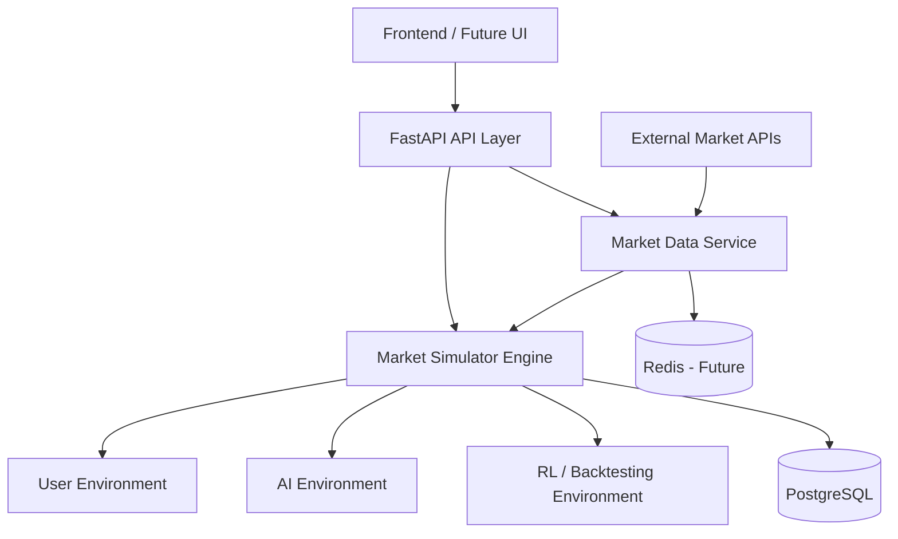
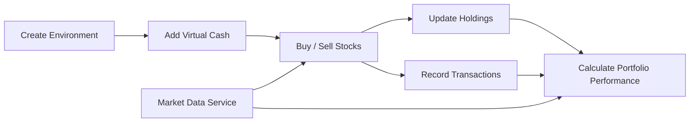
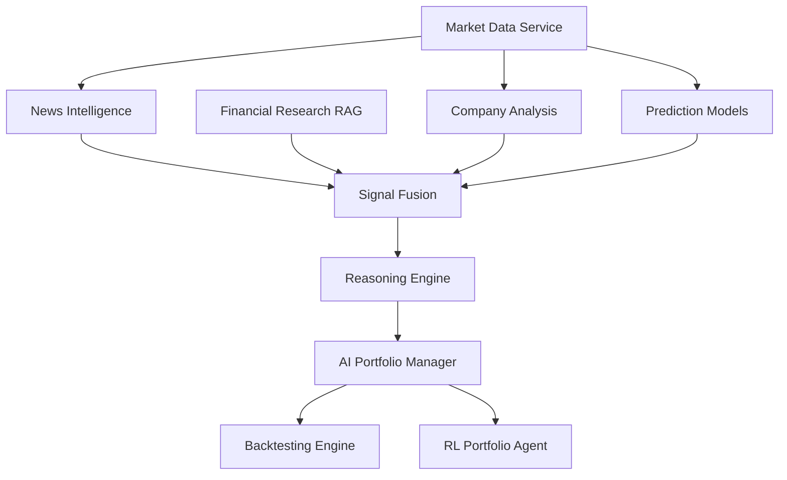
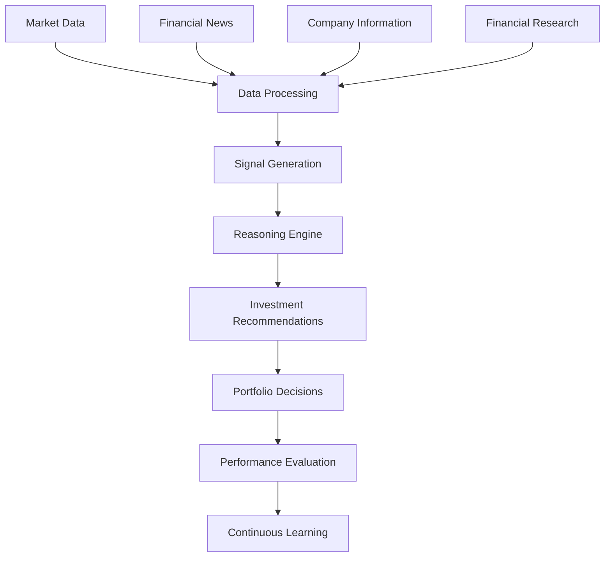

# Prospera

> Transforming information into intelligent decisions that create long-term prosperity.

## Overview

Prospera is an agentic financial intelligence platform designed to turn market data, news, research, and predictive models into explainable investment intelligence.

The platform starts with a strong backend foundation: a multi-environment market simulator powered by a centralized market data service. Over time, that foundation expands into research, reasoning, prediction, backtesting, and autonomous portfolio management.

## Current Scope

The current focus is **V1 backend foundation**.

V1 includes:
- A market simulator engine (Phase 5) with isolated, persistent portfolio environments
- A centralized market data service (Phase 6) for normalized historical prices, index data, company metadata, sectors, and industries
- A news intelligence pipeline (Phase 7) with collection, deduplication, cleaning, classification, and warehouse storage for global, Indian, company, and sector news
- Clean backend architecture for future expansion

V1 does not yet include:
- Structured event extraction from news (Phase 8)
- Research RAG implementation
- Prediction model training
- RL agents
- Full frontend implementation

## Product Vision

Prospera is being designed to support:
- Market simulation
- Portfolio management
- Market data intelligence
- News intelligence
- Financial research RAG
- Company analysis
- Prediction models
- Backtesting
- F&O intelligence
- Multi-agent reasoning
- Reinforcement learning

The long-term goal is not just prediction. The goal is to build a transparent and explainable financial intelligence system that helps users and AI agents make higher-quality investment decisions.

## Architecture Principles

The backend is being built around a few strict principles:
- Clean Architecture
- Separation of concerns
- Service layer pattern
- Isolated business modules
- Shared market data access through one internal service
- Minimal V1 scope with room for future scale

## System Overview

The core system is centered on two foundation components:
- `Market Data Service`: the single internal gateway for quotes, history, symbol lookup, and metadata
- `Market Simulator`: the isolated environment engine used by users, AI agents, and future RL agents



## V1 Simulator Flow

Each simulator environment is independent. All environments use the same market data service, but each one maintains its own cash, holdings, transactions, and performance history.



## Intelligence Evolution Flow

The V1 simulator is the foundation. Future intelligence layers will be built on top of the same shared data and portfolio infrastructure.



## Daily Intelligence Pipeline

At maturity, Prospera is expected to operate as a continuous intelligence pipeline.



## Backend Folder Structure

The backend is organized by responsibility, not by framework convenience.

```text
main/
└── backend/                     # Backend root and application assembly boundary
    ├── api/                     # HTTP transport layer and route composition
    │   └── routes/              # Endpoint groups for environments, portfolios, market data, and news
    ├── core/                    # Cross-cutting configuration and shared backend concerns
    ├── modules/                 # Business modules grouped as bounded contexts
    │   ├── simulator/           # Isolated market simulator domain
    │   │   ├── domain/          # Business entities, value objects, policies, repository contracts
    │   │   ├── application/     # Commands, queries, DTOs, and service orchestration
    │   │   └── infrastructure/  # Persistence models, migrations, and repository implementations
    │   ├── market_data/         # Shared market data service boundary
    │   │   ├── domain/          # Quotes, instruments, history, and provider-agnostic contracts
    │   │   ├── application/     # Internal market data use cases and service contracts
    │   │   └── infrastructure/  # Provider clients, adapters, migrations, and caching implementations
    │   └── news/                # News intelligence warehouse and ingestion pipeline
    │       ├── domain/          # Article entities and repository contracts
    │       ├── application/     # Sync/query services, provider contracts, and DTOs
    │       └── infrastructure/  # Provider adapters, migrations, and persistence models
    ├── shared/                  # Small shared primitives used across modules
    ├── tests/                   # Pytest suite covering all modules
    ├── app.py                   # FastAPI entry point
    └── __init__.py              # Backend package marker
```

## Folder Responsibility Guide

### `backend/api`

Purpose:
Expose backend capabilities through HTTP interfaces.

Should contain:
Routers, request mapping, response mapping, and dependency wiring.

Should not contain:
Trading logic, database queries, or direct external market API calls.

### `backend/core`

Purpose:
Hold shared operational concerns used across the backend.

Should contain:
Configuration, shared exceptions, and future app lifecycle helpers.

Should not contain:
Business workflows or module-specific logic.

### `backend/modules/simulator`

Purpose:
Own the V1 market simulator and environment-isolation model.

Should contain:
Environment lifecycle, cash operations, trades, holdings, transactions, and performance workflows.

Should not contain:
Direct vendor integrations or unrelated intelligence modules.

### `backend/modules/market_data`

Purpose:
Provide a centralized internal gateway for market information.

Should contain:
Quote retrieval, historical prices, symbol lookup, metadata, provider abstractions, and future cache integration.

Should not contain:
Portfolio rules or simulator state management.

### `backend/modules/news`

Purpose:
Own the news intelligence warehouse and ingestion pipeline.

Should contain:
Provider adapters, article cleaning/classification/deduplication logic, and warehouse query workflows.

Should not contain:
Trading logic, structured event extraction, or reasoning/signal generation (later phases).

## Phase 6 Market Data Pipeline

The market data module is now the single source of truth for historical market datasets used by the simulator, future backtesting, prediction models, portfolio analytics, company analysis, and RL environments.

Supported datasets:
- Historical stock prices as daily OHLCV bars
- Historical index data through the same daily bar pipeline
- Company information and metadata
- Sector and industry metadata

Provider strategy:
- Finnhub remains the live quote, symbol lookup, and market-status provider.
- yfinance is used for free historical price and company profile ingestion.
- Downstream modules consume `MarketDataService` only and do not call external providers directly.

Storage:
- `market_instruments`: provider-independent symbol, exchange, currency, asset type, sector, industry, country, and status metadata.
- `historical_price_bars`: daily OHLCV, adjusted close, split coefficient, dividends, and source metadata. The `(symbol, price_date)` uniqueness constraint prevents duplicate bars.
- `company_profiles`: normalized company metadata, including sector and industry fields.

Synchronization:
- Historical sync validates the requested window, normalizes symbols, resolves company metadata, stores the instrument/profile, fetches only missing dates after the latest stored bar, validates/cleans provider rows, and upserts records.
- `GET /api/v1/market-data/history/{symbol}` reads normalized history and can auto-sync missing data.
- `POST /api/v1/market-data/history/sync` explicitly appends historical data.
- `GET /api/v1/market-data/profile/{symbol}` serves normalized company metadata.

Future provider integration:
Implement the provider contracts in `backend/modules/market_data/application/providers.py`, return domain entities from the adapter, and wire the provider in `backend/api/dependencies.py`. Business logic and downstream consumers should not change. Mutual fund NAV support is prepared with a provider-independent `MutualFundNavRecord` shape, but full NAV ingestion is intentionally left for a later phase.

## Phase 7 News Intelligence Pipeline

The news module is a warehouse and ingestion pipeline for global, Indian, company, and sector news, feeding future event extraction, research, and reasoning phases.

Processing stages:
`News Sources -> Collection -> Cleaning -> Classification -> Deduplication -> Storage`

Provider strategy:
- Finnhub (via the existing `MARKET_DATA_PROVIDER` / `MARKET_DATA_API_KEY` settings) supplies general market news and per-symbol company news.
- Additional providers can be added by implementing `NewsProviderContract` in `backend/modules/news/application/providers.py` and wiring the adapter in `backend/api/dependencies.py`.

Storage:
- `news_articles`: normalized articles with title, summary, body, source, category (`global`, `india`, `company`, `sector`), symbols, sectors, countries, keywords, a dedup `content_hash`, and a unique constraint on `url`.

Behavior:
- Cleaning collapses whitespace, normalizes labels, and derives a stable content hash used for deduplication.
- Classification tags India-related coverage, matches sector keywords, and promotes articles with resolved symbols to the `company` category.
- Deduplication compares URL, content hash, and provider external id before storage; `POST /api/v1/news/sync` reports `fetched_count`, `stored_count`, and `duplicate_count`.

### `backend/shared`

Purpose:
Provide small reusable primitives shared across modules.

Should contain:
Identifiers, timestamps, enums, and generic shared types.

Should not contain:
Large generic utility collections or feature-specific code.

## Tech Stack

### Backend

- Python
- FastAPI
- Pydantic
- SQLAlchemy
- Alembic
- PostgreSQL
- Redis

### Frontend

- Next.js
- React
- Tailwind CSS

### AI and ML

- LangGraph
- Local LLMs
- XGBoost
- LightGBM
- PyTorch
- Reinforcement Learning

### Infrastructure

- Docker
- GitHub
- GitHub Actions

## Backend Environment Setup

The backend should currently be set up with **Python 3.11**.

Python `3.14` may fail while installing dependencies in this stack because some packages, especially `pydantic-core`, may not resolve cleanly there in this environment.

Recommended setup:

```powershell
cd "c:\Users\vishe\OneDrive\Desktop\VS Code Workspaces\prospera.ai"
py -3.11 -m venv .venv
.venv\Scripts\Activate.ps1
python -m pip install --upgrade pip
pip install -r requirements.txt
pip install -r requirements-dev.txt
Copy-Item .env.example .env
```

If a previous `.venv` was created with Python `3.14`, recreate it with Python `3.11`.

## Roadmap

The full phase-by-phase roadmap lives in [PLAN.md](PLAN.md). Current status:

| Phase | Scope | Status |
|-------|-------|--------|
| 1-3 | Planning, project setup, frontend foundation | Done |
| 4 | Core database layer | Done |
| 5 | Market simulator | Done |
| 6 | Market data pipeline | Done |
| 7 | News intelligence pipeline | Done |
| 8 | Event extraction engine | Not started |
| 9-21 | Research RAG through production deployment | Not started |

## Mission

Prospera exists to help people navigate uncertainty, transform information into insight, and make intelligent decisions that contribute to long-term prosperity.
